# LiveCoding-Intro-Godot
/// Intro a Godot: creando nuestro primer videojuego ➔ https://www.youtube.com/watch?v=4JYdLynqJNg

* 1. [Acerca de Godot](#AcercadeGodot)
* 2. [Descargando el motor](#Descargandoelmotor)
* 3. [Conociendo la Interfaz](#ConociendolaInterfaz)
	* 3.1. [Panel de escenas](#Paneldeescenas)
	* 3.2. [Menú superior y pestañas](#Mensuperiorypestaas)
	* 3.3. [Inspector](#Inspector)
	* 3.4. [Sistema de archivos](#Sistemadearchivos)
	* 3.5. [Ventana de Script](#VentanadeScript)
	* 3.6. [Vista de escena](#Vistadeescena)
	* 3.7. [Pestaña de señales](#Pestaadeseales)
	* 3.8. [GDScript](#GDScript)
* 4. [Conceptos básicos](#Conceptosbsicos)
	* 4.1. [Nodos](#Nodos)
	* 4.2. [Señales](#Seales)
	* 4.3. [Escena](#Escena)
* 5. [Creando nuestro primer videojuego](#Creandonuestroprimervideojuego)
	* 5.1. [Crear un nuevo proyecto](#Crearunnuevoproyecto)
	* 5.2. [Creando el jugador](#Creandoeljugador)
		* 5.2.1. [CharacterBody2D](#CharacterBody2D)
		* 5.2.2. [Sprite2D](#Sprite2D)
		* 5.2.3. [CollisionShape2D](#CollisionShape2D)
		* 5.2.4. [Script de movimiento](#Scriptdemovimiento)
* 6. [Creando nuestra escena principal de juego](#Creandonuestraescenaprincipaldejuego)
* 7. [Creando obstaculos](#Creandoobstaculos)
* 8. [Añadir objeto interactivo](#Aadirobjetointeractivo)


##  1. <a name='AcercadeGodot'></a>Acerca de Godot 
Godot se ha consolidado como una de las opciones más populares para el desarrollo de videojuegos, destacando como el único motor de los tres principales que cuenta con una licencia de código abierto y libre (MIT). Cuenta con más de 2500 contributors, lo cual ha impulsado su crecimiento en los últimos años.

Uno de los principios de Godot es ofrecer una experiencia de aprendizaje amigable, por lo que tiene una curva de aprendizaje suave que facilita la incorporación tanto de principantes como desarrolladores más experimentados.

Te permite exportar para diferentes plataformas de manera nativa (PC, móviles y web) y cuenta con interfaces para añadir funcionalidad extra al motor a través de extensiones en C++.

##  2. <a name='Descargandoelmotor'></a>Descargando el motor
- Visita la página oficial de Godot: https://godotengine.org/
- Descarga la última versión estable que se adapte a tu sistema operativo (Windows, macOS o Linux). En el momento que se realizó este taller se trata de la 4.3
- Podemos elegir entre descargar la versión con .NET embebido o el motor base. En este caso, como no vamos a programar usando C#, podemos descargar el base.
- Descarga el archivo comprimido correspondiente y descomprímelo.

Se trata de una aplicación standalone, por lo que no requiere instalación.

##  3. <a name='ConociendolaInterfaz'></a>Conociendo la Interfaz
###  3.1. <a name='Paneldeescenas:'></a>Panel de escenas:
Aquí es donde se construye la escena de tu juego, agregando y organizando los nodos que representan los diferentes elementos visuales y funcionales de tu juego.

###  3.2. <a name='Mensuperiorypestaas'></a>Menú superior y pestañas
Te permite selecccionar las distitnas opciones, cambiar entre la vista de escena o scripts y ejecutar nuestro juego.

###  3.3. <a name='Inspector'></a>Inspector
Nos da información extra sobre el objeto (nodo) que tenemos seleccionado en nuestro panel de escenas. Desde aquí podemos ver la información del nodo y cambiar sus características si fuera necesario.

###  3.4. <a name='Sistemadearchivos'></a>Sistema de archivos
Los archivos que están incluídos en nuestros proyectos, como scripts, imágenes o archivos de audio, que podrémos agregar a nuestras escenas para crear nuestro juego.

###  3.5. <a name='VentanadeScript'></a>Ventana de Script
Godot tiene un IDE integrado, por lo que podremos escribir código para el juego sin necesidad de abrir un editor externo. 

###  3.6. <a name='Vistadeescena'></a>Vista de escena
La representación visual de la escena que estamos modificando y que está abierta en nuestro panel de escenas. Aquí podremos mover, reescalar o rotar los diferentes objetos que forman la escena y se verán reflejados en el panel de escena.

###  3.7. <a name='Pestaadeseales'></a>Pestaña de señales
En esta ventana podemos conectar señales, del objeto (nodo) seleccionado en el panel de escena. Según el tipo de nodo que hayamos seleccionado va a emitir señales diferentes que podremos conectar con otros nodos. Es una de las maneras más simples de conectar distintos elementos del juego para que interaccionen entre ellos.

###  3.8. <a name='GDScript'></a>GDScript
Godot tiene suporte oficial de varios lenguajes de programación:
- GDScript - Desarrollado específicamente para Godot. Se trata de un lenguaje simple de tipado débil que puede recordarnos mucho a Python.
- C#
- C++ - A través de de GDExtension. Normalmente no se usará para programar el comportamiento del juego, pero puede resultar muy útil para optimizar determinados cálculos a bajo nivel o implementar módulos o funcionalidad extra al motor.

También hay varios lenguajes soportados por la comunidad, como son JavaScript, Lua, Nim, Rust o Typescript.

##  4. <a name='Conceptosbsicos'></a>Conceptos básicos
###  4.1. <a name='Nodos'></a>Nodos
Es la base de Godot. Cada uno de los objetos que añades a una escena es un Nodo el cuál está contenido en otros nodos. Cualquier Nodo puede tener un script que extienda su comportamiento. Puedes guardar estos nodos en tu Sistema de archivos como una **Escena** para poder reutilizarla más adelante.
###  4.2. <a name='Seales'></a>Señales
Son eventos con los que los nodos se comunican entre ellos. Pueden configurarse tanto en los scripts como en el mismo editor.
###  4.3. <a name='Escena'></a>Escena
Son nodos que has guardado en el Sistema de Archivos para reutilizar más adelante. Se pueden crear copias (instancias) tanto a través de código como arrastrándolo a nuestra ventana de juego.


##  5. <a name='Creandonuestroprimervideojuego'></a>Creando nuestro primer videojuego
###  5.1. <a name='Crearunnuevoproyecto'></a>Crear un nuevo proyecto
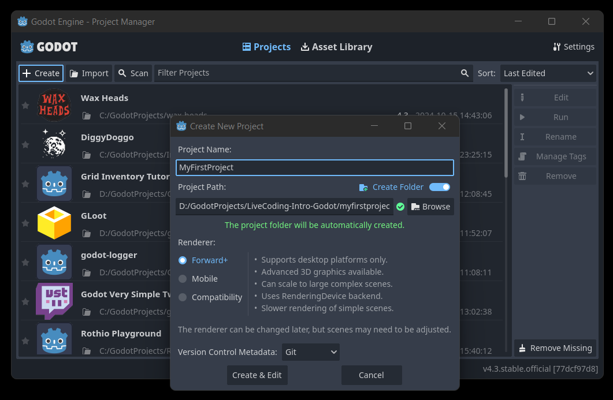
Abre el ejecutable que acabas de descargar y pulsa sobre Crear. Aquí puedes elegir el lugar donde se va a crear el proyecto.

###  5.2. <a name='Creandoeljugador'></a>Creando el jugador
####  5.2.1. <a name='CharacterBody2D'></a>CharacterBody2D

Vamos a crear un nuevo Nodo Raíz y buscaremos un CharacterBody2D. Se trata de un nodo tipo 2D que tiene funcionalidad básica para mover un personaje en un escenario.
####  5.2.2. <a name='Sprite2D'></a>Sprite2D
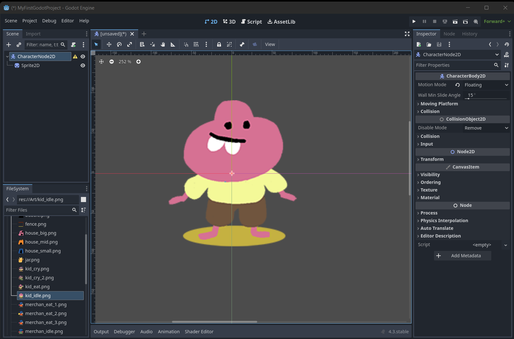
Pero además de moverse, necesitaremos que nuestro personaje tenga una representación visual en el juego. Vamos a añadir un hijo a nuestro jugador de tipo Sprite2D y asignarle a este la imagen de nuestro personaje.
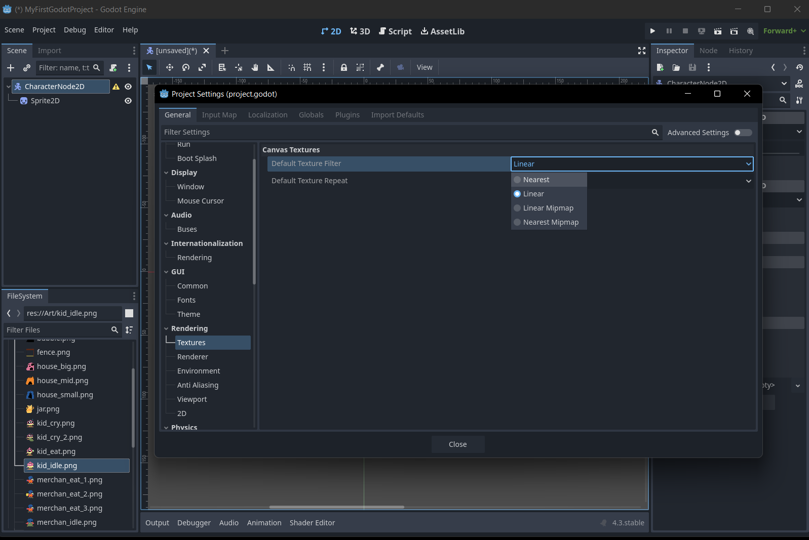
Si no nos gusta el suavizado que añade Godot a nuestro sprite, podemos cammbiar la manera en la que se van a renderizar las texturas. Para ello vamos a Proyecto -> Configuración del proyecto -> Renderizado de texturas -> Filtro y lo setearemos como Nearest.
####  5.2.3. <a name='CollisionShape2D'></a>CollisionShape2D
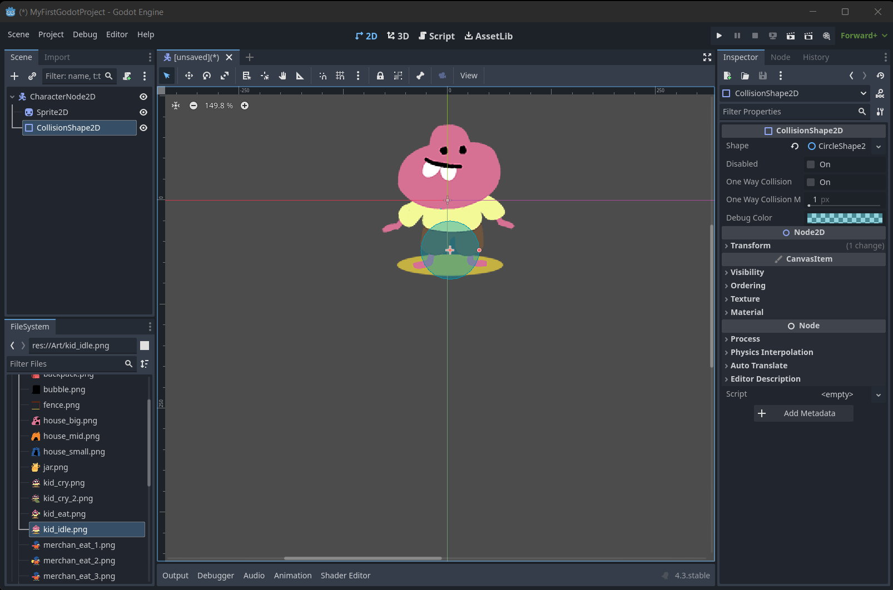

Querremos también que nuestro personaje pueda chocarse contra objetos o recoger objetos del suelo. Para ello vamos a añadir un CollisionShape2D como hijo de nuestro juigador y, en el inspector, poner una forma circular, ya que es la que más se adapta a nuestro personaje.

####  5.2.4. <a name='Scriptdemovimiento'></a>Script de movimiento
Vamos a añadir un script a nuestro CharacterBody, así le diremos cómo queremos que se mueva. Vamos a crear un nodo por defecto aunque Godot nos permite tener una plantilla de movimiento básico, haremos uno más simple.

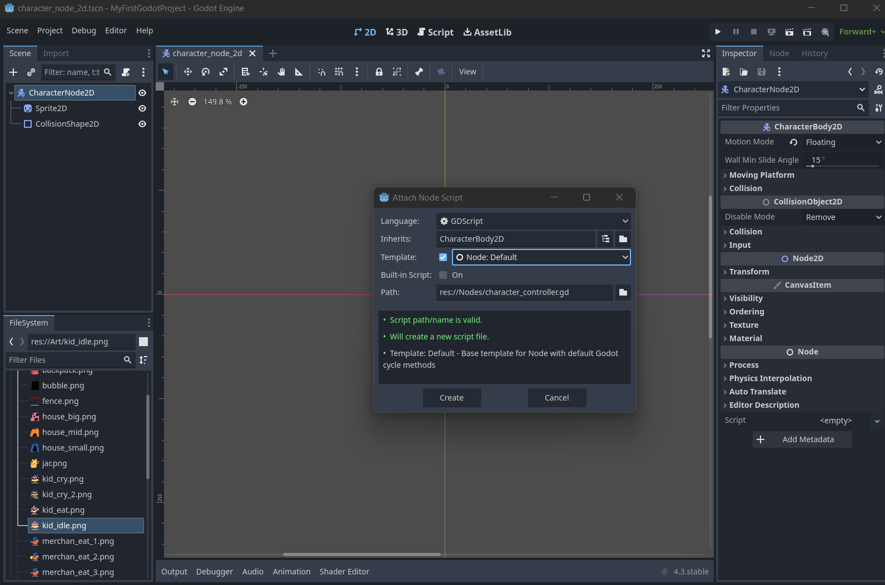

``` GDScript
extends CharacterBody2D
@export var speed: int = 200

func _physics_process(delta):
	var direction = Input.get_vector("ui_left", "ui_right", "ui_up", "ui_down")
	velocity = direction * speed
	move_and_slide()
```

Nuestro script extiende CharacterBody2D, que es la clase del nodo. Tiene una variable speed la cual es de tipo entero e inicializamos en 200 y añadimos la anotación @export para que se pueda serializar en el inspector y poder modificarla sin necesidad de cambiar el script.

En nuestro método physics_process, el cual está declarado en una de las clases de las que hereda nuestro script, vamos a dar las instrucciones para que el personaje se mueva. utilizaremos la clase Input para conseguir el vector de dirección que viene de las flechas de movimiento y asignaremos a la velocidad del personaje ese valor junto al multiplicador de velocidad. También podemos multiplicarlo por delta si queremos que la velocidad sea independiente a la frecuencia de refresco de la pantalla.

Justo después, llamámos al método ```move_and_slide()``` para que el personaje sepa resolver su movimiento.

##  6. <a name='Creandonuestraescenaprincipaldejuego'></a>Creando nuestra escena principal de juego
Nuestro personaje principal ya está listo, ahora necesitamos un entorno por donde pueda moverse. Para ello, hacemos una nueva Escena que sea un Nodo2D y la guardamos en el Sistema de Archivos.

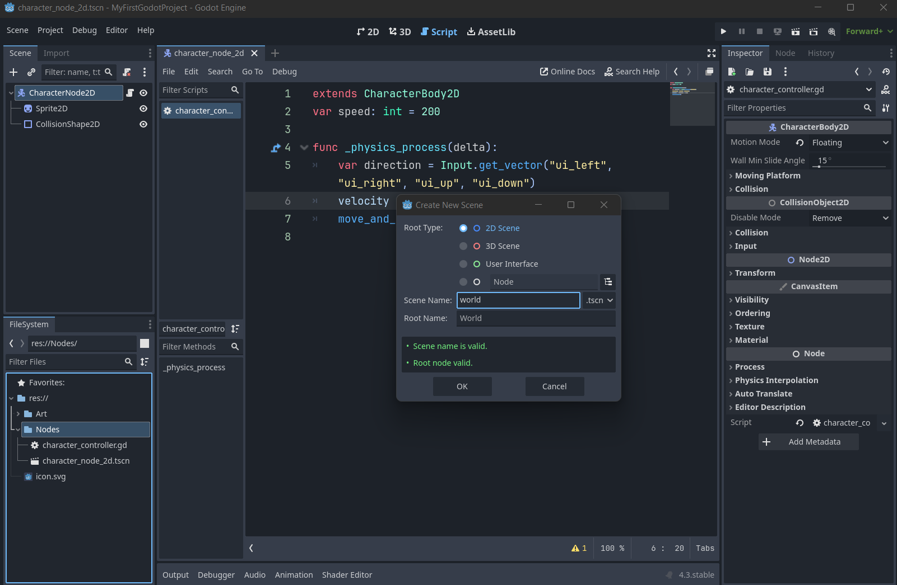

Una vez creado nuestro mundo, podemos añadir al personaje principal para que pueda desplazarse por él. Para ello basta con arrastrar la escena de personaje que hemos creado previamente a nuestro nueva escena y pulsar sobre el botón de jugar (play) en la esquina superior derecha.

Como aún no tenemos ninguna escena como la principal de nuestro juego, nos preguntará si es la actual. Decimos que sí y podemos probar cómo ya se mueve nuestro personaje

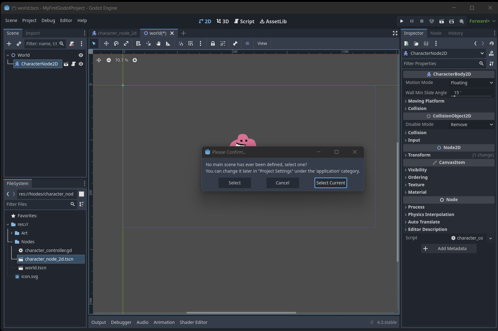


##  7. <a name='Creandoobstaculos'></a>Creando obstaculos
Ahora que tenemos nuestro personaje que se puede mover libremente por el entorno, podemos añadir objetos con los que pueda chocar. Para hacer eso, podemos crear un nuevo Nodo 2D de tipo ```StaticBody2D``` y añadirle un Sprite2D y CollisionShape2D como hicimos con nuestro personaje

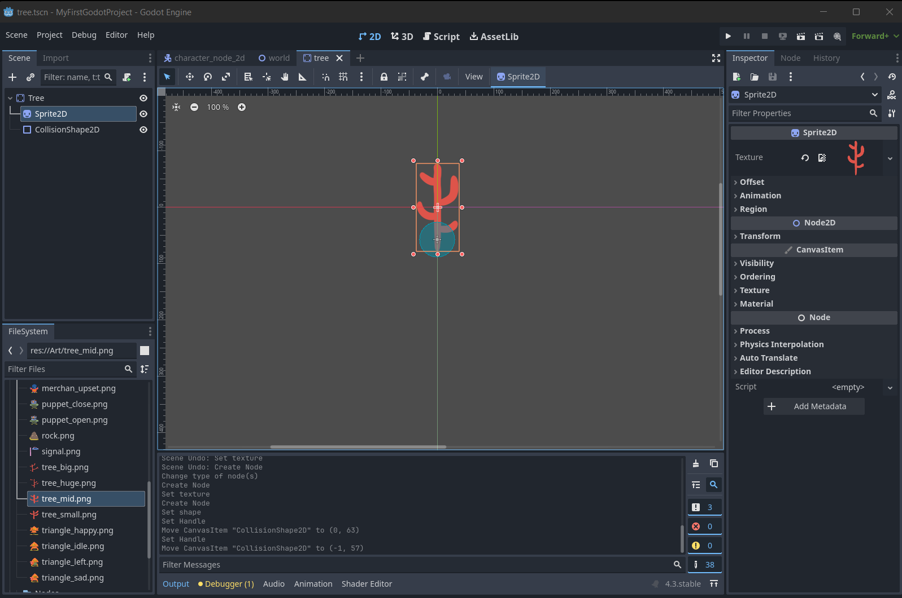

Simplemente arrastrando estos nuevos elementos a nuestra escena principal, vemos que el personaje no puede atravesarlos.

Pero tenemos un nuevo problema, parece que el personaje no se dibuja detrás de los obstáculos cuando debería. Para resolver esto, solo tenemos que activar la opción de Y Sorting en la raíz de nuestra escena principal.

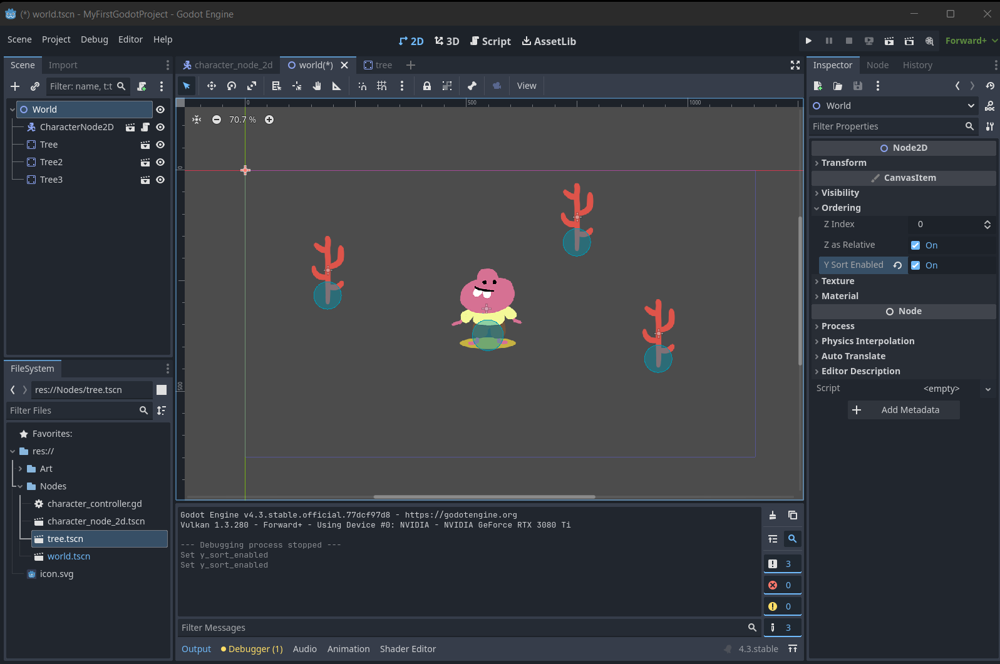

##  8. <a name='Aadirobjetointeractivo'></a>Añadir objeto interactivo
Es común en un videojuego querer que tus elementos de juego interaccionen algo más que simplemente chocando entre ellos. Vamos a crear un pequeño objeto que detecte cuando nuestro personaje principal entre en su rango y muestre un mensaje de victoria.

Para ello, creamos un nuevo nodo Area2D y le añadimos un Sprite2D y una CollisionShape2D como hicimos antes. Le vamos a añadir también un objeto de tipo Label que va a mostrar un texto de victoria en pantalla.


Ocultamos nuestro recién creado texto de victoria pulsando en el ojo junto a su nombre en el panel de Escenas ya que querremos enseñarlo en el momento que nuestro protagonista se acerque a este objeto. Le añadiremos también un script que maneje la interacción en la raíz de nuestro objeto.


Una vez creado este script, tendremos que conectarlo con la señal que se emite cuando un objeto entra en el CollisionShape2D de un Area2D. Para ello, pulsamos en la pestaña de Nodo a la derecha del Inspector y encontramos 

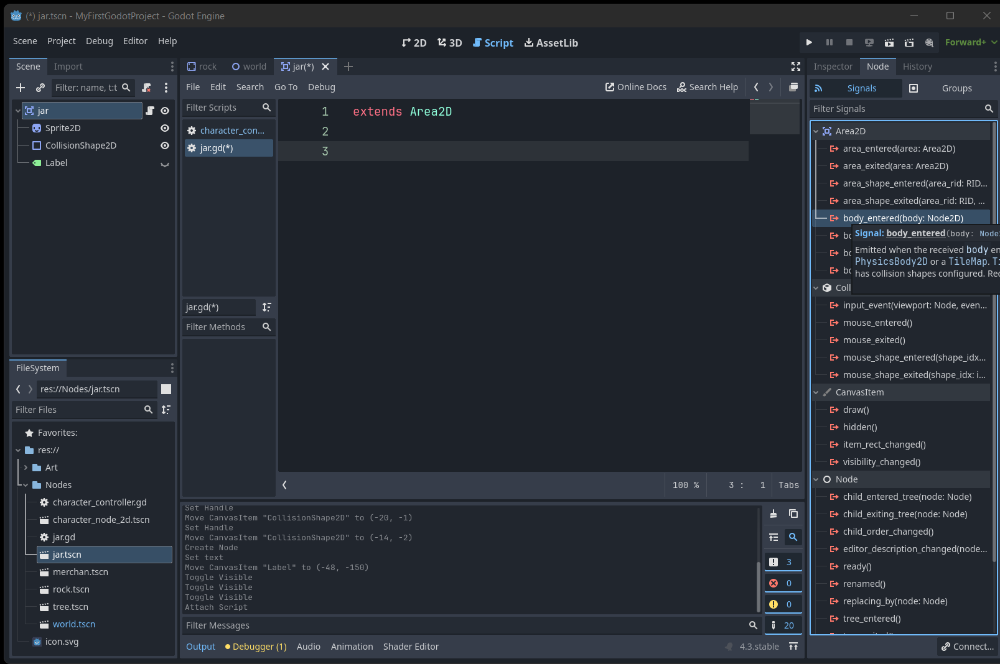

Conectamos la señal elegida al script que acabamos de crear en la ventana que aparece al seleccionarlo.

```GDScript
extends Area2D

@onready var sprite_2d: Sprite2D = $Sprite2D
@onready var collision_shape_2d: CollisionShape2D = $CollisionShape2D
@onready var label: Label = $Label


func _on_body_entered(body: Node2D) -> void:
	sprite_2d.hide()
	collision_shape_2d.disabled = true
	label.show()
```
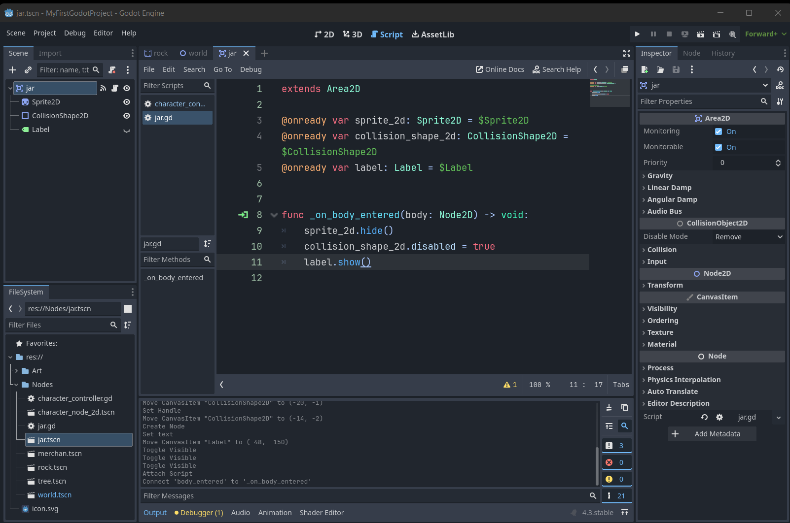

En el script de nuestro jarrón, recogeremos las referencias a nuestros Sprites, CollisionShape2D y Label para poder modificar su comportamiento cuando se emita la señal que hemos conectado. En el método que se creó cuando conectamos la señal, vamos a ocultar el Sprite2D y el CollisionShape2D y mostraremos el mensaje de victoria.

## 9. ¡Y esto es solo el principio!

¡Ya tenemos nuestro primer juego terminado! Ahora podemos añadir nuevos elementos como rocas, otros comportamientos como mercaderes que hablen con nosotros o decorar aún más el entorno. Te recomiendo que sigas investigando sobre cómo exportar tu juego para que otras personas puedan jugarlo (¡Es muy sencillo!), añadir sonidos, animaciones o una cámara que pueda seguir al jugador. ¡Es más fácil de lo que imaginas!

Podéis consultar la [documentación oficial de Godot](https://docs.godotengine.org/es/4.x/) o seguir [mi trabajo en redes sociales](https://linktr.ee/rothiotome) para ver qué más se puede hacer con este fantástico motor


## 10. Notas.

Todas las imágenes de este proyecto son propiedad de Murray Somerwolff y están distribuidas bajo [licencia CC BY-NC 4.0](https://www.creativecommons.org/licenses/by-nc/4.0/deed.en)